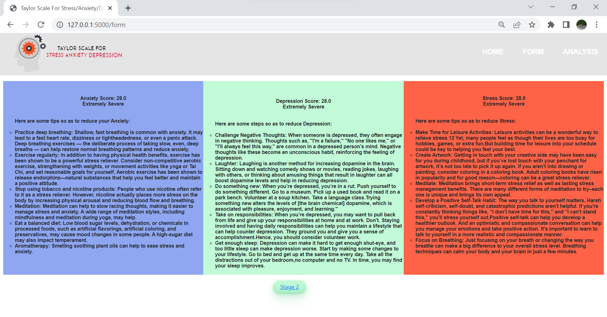
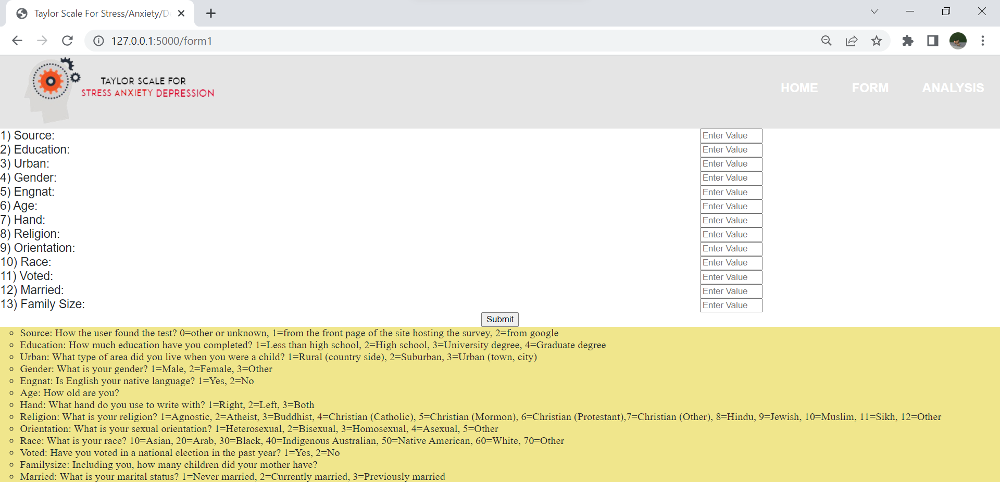
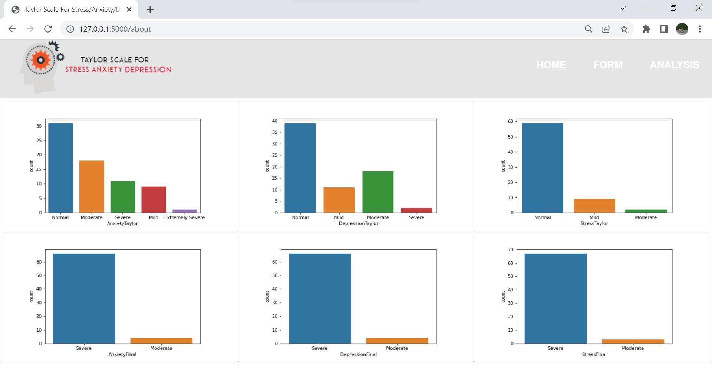

# SE
The project entitled "Taylor Scale for predicting stress/ depression/ anxiety" is a python-based website. The project's main aim is to identify if a person is going through stress/depression/anxiety. It asks us 21 different questions; each score out of 4 and some other personal questions that help us understand what a person is going through. It is essential to know the difference between these three terms. 
Depression refers to an experience where we feel down most of the time, called "low mood", and you have also lost interest in things you usually enjoy. We may also have changes in sleep, appetite, feeling guilty, de-motivated, and generally withdrawing from others.
A sense of feeling overwhelmed usually characterizes stress. This feeling may be due to our coping capacity being over-stretched or under pressure for too long. Some stress can help us perform our day-to-day functions; too much stress leaves us "distressed" and often exhausted.
Anxiety is a sense of fear or dread that something terrible will happen. Anxiety can be general or specific to a place, social situation, or thing (phobia). 
People usually get confused among these terms and treat them as one sometimes. They all are different; hence their treatment/measures are also different. 
A few screenshots of the working website: 
<b>Screenshots</b> 
1) Start Screen 
 
2) Taking Input From User (Stage-1) 
 
3) Displaying Result And Remedies To User 
 
4) Taking Input From User (Stage-2) 
 
5) Displaying Result And Remedies To User 
 
6) Displaying The Statistics To The User 

